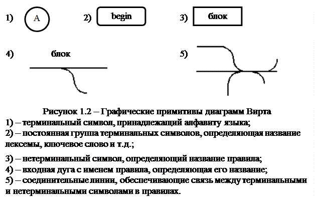
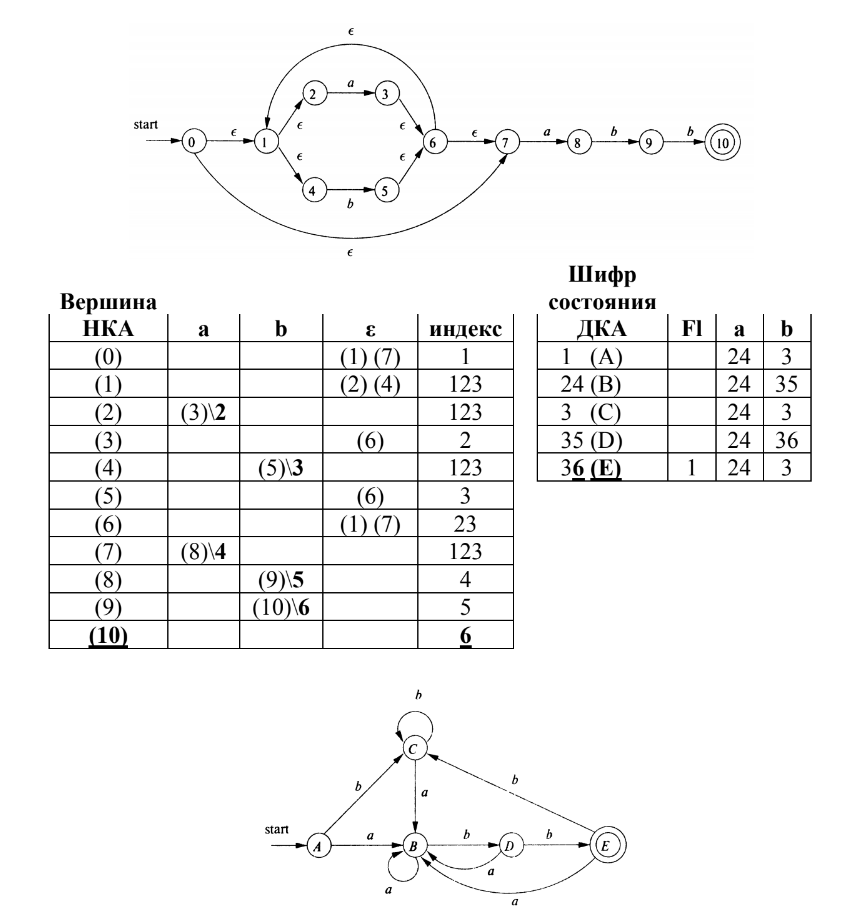
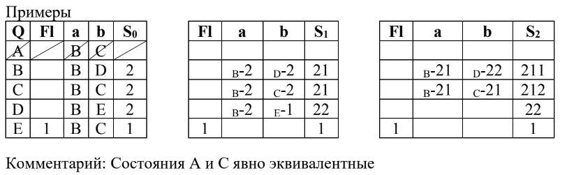
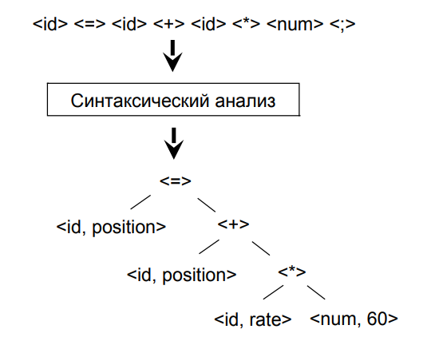
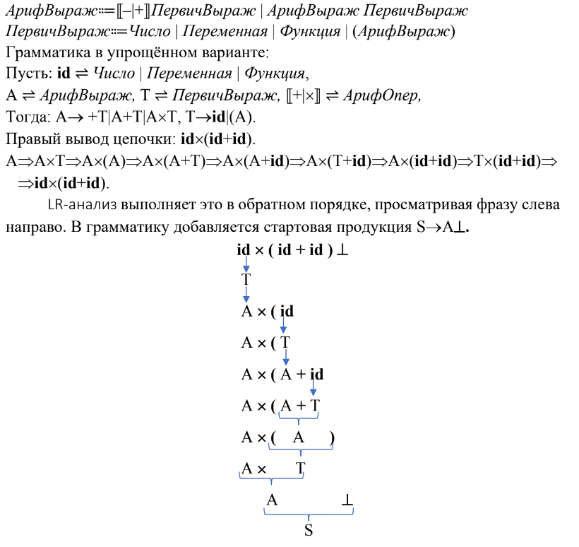
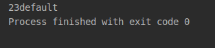

# Ответы на экзаменационные вопросы по курсу "*Теория Автоматов и Формальных Языков*"

**Учебный год**: 2019 – 2020

**Семестр**: 5

**Преподаватель**: Антик Михаил Ильич

## 1. Основные задачи процесса трансляции и их назначение

Трансляция состоит из двух основных фаз (процессов): **анализа** и **синтеза**.

В первой фазе анализируется синтаксис программы, результатом которого является преобразование исходного кода в промежуточный код. В фазе синтеза промежуточный код транслируется в код исполняемый целевой машиной.

## 2. Язык программирования как формальный язык

Текст программы, это формальный язык в виде последовательности символов. Символы берутся из конечного множества, называемого **словарём** (алфавитом) языка.

Программа состоит из частей (объектов), образованных последовательностями символов, называемых **синтаксическими понятиями**, таких, как операторы, выражения, описания,... Структура синтаксических понятий должна быть образована в соответствии с синтаксическими правилами и распознаётся транслятором в соответствии с этими же правилами.

Текстам, полученным в соответствии с синтаксическими правилами, придаётся **семантика**, т.е. определённое понимание смысла этих текстов; семантика накладывает некоторые дополнительные ограничения на допустимые в языке тексты. Программа семантически трактуется как законченное предписание для выполнения некоторого вычислительного процесса.

> Тем самым *синтаксис* указывает правила написания (конструкции) объектов языка, а *семантика* разъясняет использование этих объектов для реализации вычислений.

Набор синтаксических правил называют **грамматикой языка**. Синтаксические правила записываются на другом формальном языке. Язык, предназначенный для описания другого языка, называется **метаязыком**.

## 3. Синтаксические правила в расширенной форме Бэкуса-Наура

Синтаксические правила в *БНрФ* выглядят следующим образом:

```
СинтаксическоеПонятие::=СинтаксическаяФормула.
           (Заголовок::=Тело)
```

В формуле одного *синтаксического понятия* используется другое *синтаксическое понятие*, которое в свою очередь определяется через *формулу*. Каждое *синтаксическое понятие* упомянутое в синтаксической формуле должно быть определено *синтаксическим правилом*. Таким образом множество *синтаксических правил* образует иерархическую структуру. Обычная практика использования замены (подстановки) в математике с тем, чтобы получить окончательное выражение (конструкцию объекта языка).

В окончательном (завершённом) варианте синтаксическая переменная должна быть определена через некоторые *неделимые* (*атомарные*) элементы языка программирования их называют **терминалами**. На разных этапах трансляции *терминалами* являются различные элементы на начальном этапе это *литеры*, на следующем этапе трансляции это *лексемы*. *Терминалы* записываются точно также как в исходном тексте программы, но выделяются либо жирным шрифтом, либо подчёркиванием, либо прямоугольным контуром, например:
**array** (<u>array</u>).

Синтаксические переменные называют − **нетерминалами**.

Структура правил в *БНрФ* следующая:

* *А::=ВС* означает что понятие А состоит из следующих друг за другом грамматических конструкций А и В, т.е. их **катенации**.

* *А::=В|С|D* означает, что А состоит **либо** из В, **либо** из С, **либо** из D (перечисление альтернатив).

* *А::=(B|C|D)E* вместо *А::=BE|CE|DE*

* *А::=[В]* конструкция *В* **либо** присутствует **один раз**, **либо ни разу**

* *А::={В}* конструкция *А* может состоять из **любого числа (включая нуль)** конструкций *В* (**катенаций** конструкции *В*).

> Здесь символы «::=», «|», «()», «[]», «{}» являются **метасимволами** (т.к. принадлежат метаязыку).

## 4. Синтаксические диаграммы

Наряду с текстовыми способами описания синтаксиса языков используются и графические метаязыки, среди которых наиболее широкую известность получил **язык диаграмм Вирта**, впервые примененный для описания языка *Паскаль*. Метасимволы заменены следующими графическими обозначениями (рис. 1.2):

- **терминалы** располагаются в окружностях или прямоугольниках со скругленным вертикальными сторонами;

- **нетерминалы** заносятся внутрь прямоугольников;
- каждый графический элемент, соответствующий терминалу или нетерминалу, имеет по одному входу и выходу, которые расположены на противоположных сторонах контура;

- каждому правилу соответствует своя графическая диаграмма, на которой терминалы и нетерминалы соединяются посредством дуг;
- должна быть одна входная дуга (располагается обычно слева и сверху), задающая начало правила и помеченная именем определяемого нетерминала, и одна выходная, задающая его конец (обычно располагается справа и снизу).



## 5. Основные определения формальных языков и грамматик (алфавит, слова, языки, грамматики, терминалы, нетерминалы, продукции, вывод,....)

* **Алфавитом** называется конечное непустое множество А={a~1~,...,a~n~}. Его элементы a~t~ называются **символами**.

* **Словом** (*цепочкой*, *строкой*, *кортежем*) в алфавите А называется конечная последовательность ã~t~=(a~t1~,...,a~tm~) элементов А (символов).

* Множество всех слов в алфавите А обозначается **А^*^**. Множество всех непустых слов в алфавите A обозначается **A^+^**

* Если L ⸦ A^*^, то L называется **языком** (*формальным языком*) над алфавитом A.

* **Грамматикой** (*формальной грамматикой*) называется
  четвёрка *G = (T, N, P, S)*, где T и N − алфавиты.

  T − конечный *терминальный алфавит*, его элементы называются *терминальными символами* или **терминалами**;

  N – конечный *нетерминальный алфавит*, его элементы называются *нетерминальными символами*, **нетерминалами** или *переменными*; T ∩ N = ∅;

  S – начальный символ, S ∈ N;
  P – *правила подстановки* или **продукции**, P ⸦ (T ∪ N)^+^× (T ∪ N)^*^, множество P конечно, пары (α, β) ∈ P записываются в виде α → β.

* Если ω~0~ ~G~⇒ ω~1~ ~G~⇒ ... ~G~⇒ ω~n~, где n > 0, то пишем ω~0~ ~G~⇒^*^ ω~n~.
  При этом последовательность слов ω~0~, ω~1~,..., ω~n~ называется **выводом** слова ω~n~
  из слова ω~0~ в грамматике G. Число n называется **длиной** (количеством шагов)
  этого вывода.

## 6. Входные и выходные данные фазы лексического анализа

> **Лексический анализатор** — это модуль *транслятора*, **входом** которого служит цепочка символов, представляющих исходную программу, а **выходом** – последовательность токенов и таблиц (базы данных) с ними (токенами) связанные. 

Таблицы могут быть следующие:

* заранее составленные
* таблица зарезервированных имён и таблица ограничителей
* таблица имён, которая формируется в процессе анализа.

## 7. Конечные автоматы и языки ими распознаваемые

**Конечный автомат** − это пятёрка *H=(Q,T,Δ,S,F)*, где
T − конечный алфавит,
Q − конечное множество, элементы которого называются состояниями,

S − начальные состояния, S ⸦ Q,
F − заключительные или допускающие состояния, F ⸦ Q,
Δ − конечное множество отношений, Δ ⸦ Q×T^*^×Q, если (p,ã,q)∈Δ, то (p,ã,q)
называется переходом из p в q, слово ã − меткой этого перехода.

**Язык, распознаваемый конечным автоматом** *H*, − это язык
L(H), состоящий из меток всех успешных путей (то есть из всех допускаемых
данным автоматом слов). Будем также говорить, что автомат H распознаёт
язык L(H).

## 8. Эквивалентные представления автоматных языков формальной грамматикой

U → a, U → aU' (U → U'a), где U и U' – *нетерминальные символы*, a – *терминальный символ*. Языки такого вида (3 по Хомскому) называют **автоматными языками**.

Источник: [Теория формальных грамматик](http://portal.tpu.ru:7777/SHARED/t/TRACEY/Courses/theory/Tab_automata_textbooks/Lec_09.pdf)

## 9. Преобразование недетерминированных конечных автоматов в детерминированные

> *Конечный автомат* называется **конечным детерминированным автоматом** (*ДКА*), если для каждого состояния *q* и каждого символа *a* в алфавите меток существует в точности один переход (дуга в орграфе автомата), из *q* помеченный символом *a*, и кроме того, имеется только одна начальная вершина. В этом случае отношение Δ является функциональным отношением *δ : Q×Т → Q (p = δ(q,t), p∈Q, q∈Q, t∈T)*. *Конечный автомат*, не обладающий такими свойствами однозначности, будем называть **недетерминированным** конечным автоматом (*НКА*).

**Алгоритм преобразования НКА в ДКА**. Будем называть состояния НКА вершинами, состояния ДКА состояниями.

0. «Чистка» НКА (не обязательное действие, но сокращающее трудоёмкость алгоритма детерминизации). Из НКА удаляются:

   * петли без меток;
   * вершины, недостижимые из начальных вершин;
   * вершины, из которых недостижимы заключительные вершины.

1. Таблица НКА. В таблице должны быть следующие столбцы:

   * имя вершины;

   * индекс вершины;

   * индикатор (флаг) финальной вершины

   * остальные столбцы соответствуют всем символам входного алфавита плюс пустой символ.

    Первая строка таблицы соответствует единственной входной вершине.

    Если входных вершин было более одной, то это будет новая вершина, которая соединяется дугами без меток (пустой меткой) со всеми старыми входными вершинами. Остальные строки соответствуют всем вершинам НКА.

2. Нумерация дуг (переходов). Каждая помеченный переход получает
   уникальный номер, начиная с 2 и далее 3,4,...
   
3. Индексация вершин. Входная вершина получает индекс 1. Вершинам НКА присваивается индекс, состоящий из номеров всех входящих в эту вершину дуг. Индекс вершины, из которой выходит пустая дуга, приписывается к индексу вершины, в которую эта дуга входит.

4. Автоматная таблица. Заготавливается таблица (пустая), в которой должны быть следующие столбцы:

   * шифр состояния;

   * флаг финальных вер-
     шин;

   * остальные столбцы соответствуют всем символам входного алфавита.

5. Заполнение строки автоматной таблицы. Первой строке, соответствующей начальному состоянию автомата, присваивается шифр 1. Начиная с этой строки, используя таблицу источника, в столбцы, именованные входными символами, записываются номера дуг, имеющих метку, совпадающую с именем столбца и выходящих из всех вершин, в индексах которых содержится какой-либо номер из шифра этого состояния (строки). Если таких дуг нет, то записывается номер 0. В строке с шифром 0 во всех столбцах содержатся нули. (Состоянию с шифром 0 соответствует “тупиковое” состояние.)

6. Порождение новых строк. После заполнения очередной строки в столбцах, именованных входными символами, записаны шифры состояний. Если в строке появились новые шифры, не встречавшиеся ранее, то они порождают новые строки.

7. Финальным будет то состояние, в шифре которого есть номер, совпадающий с каким-либо номером из индексов финальных вершин НКА.

Пример:



## 10. Минимизация детерминированных автоматов

> *Детерминированный конечный автомат*, эквивалентный заданному и имеющий наименьшее возможное число состояний, называется **минимальным**.

>Минимизация автомата возможна, если в автомате есть состояния, которые могут быть объединены в одно состояние. Такие состояния называют эквивалентными состояниями. Иначе говоря, автомат минимальный, если у него нет эквивалентных состояний.

Алгоритм:

1. Явно эквивалентные состояния заменяются одним состоянием.
2. Вычисление S~0~. Состояниям с одинаковыми флагами присваивается один
   и тот же суффикс. Автоматная таблица переписывается с записью суффиксов
   в строке состояний.
3. Вычисление S~i~. Состояниям с одинаковой комбинацией в строке выхода и суффиксов присваивается один и тот же может быть новый суффикс. Если количество различных суффиксов, т.е. классов эквивалентности не увеличилось или равно числу состояний, то вычисление классов эквивалентности закончено, иначе пункт (3).
4. За не более чем n-1 итерацию классы эквивалентности вычислены. Каждому классу эквивалентности в минимальном автомате сопоставляется одно состояние.



## 11. Варианты программной реализации фазы лексического анализа

### Непрямой лексический анализ

> **Непрямой** лексический анализатор реализуется как совокупность независимых конечных автоматов, проверяющих принадлежность к отдельным лексемам. Каждый автомат представлен соответствующей *процедурой* (*функцией*), осуществляющей имитацию переходов из начального состояния к одному из заключительных.

Автоматы связаны между собой в *последовательную цепь*, что определяет порядок передачи управления между ними в случае, если активный автомат отвергает входную цепочку символов, то есть, не может распознать предписанную ему лексему.

Конечный автомат, осуществляющий распознавание одной конкретной лексемы, может быть разбит на несколько, более мелких автоматов, каждый из которых распознает непересекающееся подмножество цепочек, принадлежащих искомому классу.

К **достоинствам** непрямого лексического анализатора следует отнести:

- прозрачность общей регулярной структуры, которая легко может изменяться и наращиваться;

- простота каждого отдельного автомата, распознающего одну, достаточно
элементарную, конструкцию;

- практическая применимость подхода в самых разнообразных языках, независимо от сложности выделения в нем тех или иных лексем.

К **недостаткам** непрямого лексического анализатора следует отнести *низкую*
*скорость распознавания*. Это связано с перебором автоматов если версия о
лексеме не подтверждается очередным автоматом.

### Прямой лексический анализ

> **Прямой** лексический анализатор строится на основе *одного детерминированного автомата*, объединяющего множество автоматов, распознающих отдельные лексемы.

Такой автомат на каждом шаге читает один входной символ и переходит в следующее состояние, приближающее его к распознаванию текущей лексемы или формированию ошибки. Для лексем, имеющих одинаковые подцепочки, автомат имеет общие фрагменты, реализующие единое множество состояний. Отличающиеся части реализуются своими фрагментами.

К **достоинствам** прямого лексического анализатора относятся:

- высокая производительность за счет отсутствия переборов отдельных автоматов;

- меньшее общее число состояний, что получается за счет слияния одинаковых фрагментов отдельных автоматов и проведения дополнительной минимизации.

К **недостаткам** следует отнести:

- на разработку прямого лексического анализатора требуется больше времени.

## 12. Регулярные языки, выражения и определения

**Регулярное выражение** над алфавитом T рекурсивно определяется следующим образом:
1. пустое слово и каждый символ а∈T являются регулярными выражениями над T, такие выражения называются **атомарными**;
2. если R~1~ и R~2~ – регулярные выражения, то таковыми являются (R~1~∪R~2~), (R~1~R~2~), R^*^;
3. все регулярные выражения над Т получаются только по правилам (1) и (2).

Каждое регулярное выражение над T очевидно задаёт некоторый язык над T. Атомарные выражения задают **атомарный язык**.

> **Регулярное выражение** – это формула, показывающая, как определяемый ею *язык* получается из отдельных символов алфавита T посредством *регулярных операций*.

Объединение и катенация позволяют порождать только конечные языки.
Операция *звезды* (*) порождает бесконечный язык, обеспечивая повторяемость некоторых фрагментов цепочек, отсюда и термин *«регулярность»* в названии этого класса языков.

> Регулярным выражениям можно присваивать имена и использовать их в последующих выражениях. Именованное регулярное выражение называют **регулярным понятием**.

## 13. Эквивалентность регулярных и автоматных языков

### I доказательство

Пусть автомат H(R) с одним начальным и одним финальным состояниями представляет язык, заданный регулярным выражением R.

* Если R=R~1~∪R~2~, то H(R) эквивалентен параллельному соединению автоматов H~1~(R~1~) и H~2~(R~2~), начальные и финальные состояния которых совмещаются.
* Если R=R~1~R~2~, то H(R) эквивалентен соединению автоматов H~1~(R~1~) и H~2~(R~2~) последовательному, в котором финальное состояние автомата H~1~(R~1~) объединяется с начальным состоянием H~2~(R~2~).
* Если R=R~1~*, то начальные и финальные состояния автомата H~1~(R~1~) совмещаются, а затем разъединяются с использованием дуг, помеченных пустым словом.

После серии таких преобразований получаем конечный автомат Н(R) с одним начальным и одним финальным состояниями, размеченный только терминальными и пустыми символами, который представляет язык, заданный регулярным выражением R.

### II доказательство

Автомат, размеченный (ε, ∀а∈Т), очевидно размечен атомарными регулярными выражениями.

* Параллельные дуги, размеченные регулярными выражениями R~1~ и R~2~ можно заменить одной дугой с разметкой R~1~∪R~2~.

* Любое промежуточное состояние можно исключить, заменяя его путями, проходящими через это состояние. Такие операции исключения дуг и состояний автомата не изменяют языка им определяемого.

Начиная с конечного автомата, размеченного символами алфавита Т и ε, исключаем дуги и промежуточные состояния, получим орграф с одной дугой, размеченной одним регулярным выражением. Тем самым любой автоматный язык, представленный конечным автоматом, можно преобразовать в регулярное выражение.

## 14. Иерархия грамматик Хомского

Иерархию грамматик Хомского образуют классы грамматик 4-ех типов.

### Тип 0

> Грамматика относится к **типу 0**, если на ее правила вывода не наложено никаких ограничений, кроме тех, которые указаны в определении грамматики.

### Тип 1

> Грамматикой **типа 1**, контекстной грамматикой (**контекстно-зависимой** грамматикой) называется грамматика, каждое правило которой имеет вид
> ηAθ → ηαθ, где A ∈ N, η ∈ (Т∪N)^*^, θ ∈ (Т∪N)^*^, α ∈ (Т∪N)^+^.

### Тип 2

> Грамматикой **типа 2**, **контекстно-свободной** грамматикой (**КС**-грамматикой) называется грамматика, каждое правило которой имеет вид A → α, где A ∈ N, α ∈ (Т∪N)^*^. (заголовок→тело)

### Тип 3

> Грамматикой **типа 3**, **праволинейной** грамматикой (рациональной грамматикой, регулярной грамматикой) называется грамматика, каждое правило которой имеет вид A → ũ или A → ũB, где A ∈ N, ũ ∈ Т^*^, B ∈ N.

## 15. Контекстно-свободные грамматики

> **Контекстно-свободная грамматика** (**КС-грамматика**, **бесконтекстная грамматика**) — частный случай формальной грамматики (тип 2 по иерархии Хомского), у которой левые части всех продукций являются одиночными *нетерминалами*. Смысл термина «контекстно-свободная» заключается в том, что есть возможность применить продукцию к нетерминалу, причём независимо от контекста этого нетерминала (в отличие от общего случая неограниченной грамматики Хомского).

Язык, который может быть задан КС-грамматикой, называется *контекстно-свободным языком* или *КС-языком*.

По сути КС-грамматика — другая форма БНрФ.

КС-грамматиками задаётся грамматическая структура *большинства языков программирования*, структурированных данных и т. д.

Источник: [Контекстно-свободная грамматика](https://ru.wikipedia.org/wiki/Контекстно-свободная_грамматика)

## 16. Входные и выходные данные фазы синтаксического разбора

> **Входные данные** – лексемы, полученные после лексического анализа.

> **Выходные данные** – заключение о синтаксической правильности программы или сообщение об имеющихся ошибках.

В простейшем случае синтаксический анализ позволяет получить ответ, *принадлежит ли входная строка языку*, с которым мы ее пытаемся сопоставить или нет. Однако на практике одного такого ответа (принадлежит или нет) недостаточно и, как правило, параллельно с синтаксическим разбором происходят какие-либо действия, направленные на дальнейшее преобразование входной строки.

В простейшем случае для простых языков на этапе синтаксического анализа могут уже *производиться вычисления* (например, вычисление арифметического выражения), однако чаще на этом этапе строится внутреннее представление программы, удобное для дальнейшего анализа и обработки. Часто в качестве такого представления используется **абстрактное синтаксическое дерево** (*AST-дерево*)



Источник №1: [Синтаксический анализатор](https://studfile.net/preview/1582161/page:6/)

Источник №2: [Основы синтаксического разбора, построение синтаксических анализаторов](https://edu.vsu.ru/pluginfile.php/80770/mod_resource/content/1/Основы синтаксического разбора.pdf)

## 17. LR – анализ синтаксических конструкций

> **L** – означает сканирование входного потока слева направо.
> **R** – означает построение **правостороннего вывода** в обратном порядке.

> **Правосторонним выводом** в **КС**-грамматике называют такой вывод, в котором на каждом шаге вывода заменяется самое правое из всех вхождений нетерминальных символов.

Ещё LR-анализ называют *восходящим*, анализом снизу вверх.



Чтобы реализовать такой разбор синтезируется **LR-автомат** (*LRA*)

## 18. LR – автоматы недетерминированные и детерминированные

### Недетерминированный LR – автомат (LRAN)

Состояниями LRАN сопоставляются пункты продукций. Каждый из пунктов это позиция в продукции, отсекающая ту часть продукции, которая могла быть сопоставлена уже просмотренной части входной строки. Пункт обозначается метасимволом «•».

> Проще говоря, то, что уже было прочитано, стоит до «•», а то, что *ожидается*, стоит после.

Переходы в LRАN:

1. Из состояния A→α•θβ в состояние A→αθ•β, переход инициируется
   символом θ ∈ T∪N.

2. Переходы по пустому символу ε из состояния A→α•Bβ, где В нетерминал,
   в состояние B→•γ.

Последний из возможных пунктов в продукции (A→ω•) означает, что часть строки может быть сопоставлена телу ω продукции и она должна быть свёрнута в нетерминал А. Такие пункты соответствуют **квазисостояниям**, так как они не являются источниками переходов. Состояние в LRАN идентифицируется парой натуральных чисел (XY), где X – позиция пункта в продукции (начиная с 0), Y – номер продукции.

### Детерминированный LR – автомат (LRAD)

Состояниям LRАD соответствуют подмножества пунктов продукций и соответственно подмножества состояний LRАN. Строго говоря, LRАD не соответствует точно определению *детерминированного автомата*, но неоднозначности в переходах автомата нет.

> Проще говоря, **LRAD** – это **LRAN**, где нет переходов по пустому символу и из каждого состояния есть переход по любому символу из алфавита.

## 19. LR – автоматы со стековой памятью при разборе КС – грамматических конструкций

В процессе синтаксического анализа вместе с LRАD используются два стека:

* SS – **стек состояний**,
* SC – **стек символов**.

Количество номеров состояний в стеке состояний (SS) всегда **равно** количеству символов в стеке символов (SC). Лишние номера состояний удаляются согласно дисциплине стека.

После того как определён LRAD, который будет участвовать в обработки синтаксического объекта, выполняется алгоритм:

*Вход*: список продукций, таблица LRAD, строка токенов (в дальнейшем называемых символами) синтаксического объекта.
*Начало*: запись в стек состояний SS номера 0, запись в стек символов SC начального символа из входной строки.
Итерация:

* Прочесть (без выталкивания) с вершин стеков SS − номер состояния s,
  SC – символ x.
* Если в стеке символов SC – один стартовый нетерминал, то завершить
  обработку синтаксического объекта. Иначе
* Обратиться к таблице LRAD с тем, чтобы узнать номер и тип
  следующего состояния s~i~=δ(s,x).
  * Если s~i~ – состояние *ошибки*, то завершить обработку объекта.
  * Если s~i~ – *квазисостояние*, то выполнить сворачивание продукции: из стека символов SC убрать (*POP*) k символов, заменив (*PUSH*) их нетерминальным символом продукции, из стека состояний SS убрать (*POP*) k−1 номеров состояний.
  * Если s~i~ состояние автомата *«обычное»*, то записать (*PUSH*) его номер s~i~ в стек состояний SS, записать (*PUSH*) в стек символов SC очередной терминальный символ входной строки.

> LR синтаксический анализ с LRАD автоматом, у которого только состояния и квазисостояния называют **LR(0)** анализом.

## 20. Разбор неоднозначных КС – грамматик (LR(1) – анализ)

### Неоднозначные КС – грамматики

> КC-грамматика называется **неоднозначной**, если существует слово, которое имеет два или более левосторонних (правосторонних) вывода. В противном случае КС-грамматика называется *однозначной*.

Пример: Грамматика (слияние строк):
A→A+A|d – неоднозначная, т.к. существует более одного варианта правого вывода цепочки d+d+d.

### Проблема однозначности

> Не существует алгоритма, позволяющего по произвольной КС-грамматике G над алфавитом T (|T|≥2) узнать, является ли грамматика G *однозначной*.

### LR(1) анализ

Применяя LR-анализ к *неоднозначным* КС-грамматикам, получаем LRАD, у которого в некоторых состояниях возможны оба действия: или чтение (и возможно запись) терминального символа входной строки, или сворачивание продукции, назовём их полусостояниями. Потребуется дополнительный анализ грамматики после которого возможны следующие решения:

* полусостояние определяется **только как состояние**;
* полусостояние определяется **только как квазисостояние**;
* в полусостоянии **возможны оба действия**, в таком случае применяется **LR(1)** анализ , при котором в полусостояниях читается очередной терминал входной строки и в зависимости от его значения принимается одно из альтернативный действий, либо запись терминала в стек символов и запись состояния в стек состояний, либо сворачивание продукции.

## 21. Синтаксически управляемая трансляция

> **Синтаксически управляемой трансляцией** называют включение в синтаксические правила (продукции грамматики) *действий*, которые позволят синхронно с грамматическим разбором выполнять различные **семантические** действия: ведение таблицы имён, проверку типов, генерацию промежуточного кода.

Программные фрагменты выполняют семантические действия, когда соответствующая продукция будет использована в разборе. Тем самым процессы анализа и синтеза **совмещаются** (*синхронизируются*).

## 22. Обратная польская запись как промежуточный язык трансляции

Синтаксический разбор сопровождается семантическими действиями по созданию промежуточного кода. Такие действия могут быть связаны с любым из состояний LR детерминированного автомата. Промежуточный код должен относительно просто транслироваться в объектный код либо достаточно эффективно интерпретироваться. В качестве языка для представления промежуточного кода рассматривается **постфиксная запись** (*Postfix Notation*) «обратная польская запись». Обозначим как *PN*. Например, обычной (инфиксной) записи выражения a \* ( b + c) − (d − e) / f соответствует такая постфиксная запись: a b c + \* d e − f / −

В PN порядок операндов остался таким же, как и в инфиксной записи, учтено старшинство операций, а скобки исчезли.

> Запись выражения в такой форме очень удобна для последующей интерпретации (т.е. вычисления значения этого выражения) с помощью стека.

## 23. Обратная польская запись арифметических и логических выражений

### Алгоритм вычисления выражения, записанного в польской записи

1. Выражение просматривается один раз слева направо и для каждого
   элемента выполняются шаги (2) или (3);
   
2. Если очередной элемент PN — операнд, то его значение заносится в стек;

3. Если очередной элемент PN — операция, то на вершине стека сейчас находятся ее операнды (это следует из определения PN и предшествующих действий алгоритма); они извлекаются из стека, над ними выполняется операция, результат снова заносится в стек;

4. Когда выражение, записанное в PN, прочитано, в стеке останется один элемент — это значение всего выражения, т. е. результат вычисления.

   | Элемент |   Вычисление   |   Стек    |
   | :-----: | :------------: | :-------: |
   |    a    |                |     a     |
   |    b    |                |    ab     |
   |    c    |                |    abc    |
   |    +    |    bc+⇒ρ~1~    |   aρ~1~   |
   |    *    |  aρ~1~*⇒ρ~2~   |   ρ~2~    |
   |    d    |                |   ρ~2~d   |
   |    e    |                |  ρ~2~de   |
   |    –    |    de–⇒ρ~3~    | ρ~2~ρ~3~  |
   |    f    |                | ρ~2~ρ~3~f |
   |    /    |  ρ~3~f/⇒ρ~4~   | ρ~2~ρ~4~  |
   |    -    | ρ~2~ρ~4~–⇒ρ~5~ |   ρ~5~    |

### Замечание

1. Для интерпретации, кроме PN выражения, необходима дополнительная
    информация об операндах (например, о типах), хранящаяся в таблицах.
2. Может оказаться так, что знак бинарной операции по написанию совпадает
    со знаком унарной; например, знак «-» в большинстве языков
    программирования означает и бинарную операцию вычитания, и унарную
    операцию изменения знака. На этапе лексического анализа это различие
    должно быть установлено.
    Устранить неоднозначность можно, по крайней мере, двумя способами:
    * заменить унарную операцию бинарной, т. е. считать, что -а означает
      0 - а;
    * либо ввести специальный токен для унарной операции Трансляторы языка программирования переводят выражения из скобочной записи в обратную польскую за один просмотр строки формулы, слева направо. В алгоритме перевода используются следующие правила:
3. Перегрузка операторов требует определение типов операндов и записи в PN соответствующего варианта операции. Для определения вызова метода, который может быть полиморфным потребуется более сложный семантический анализ, связанный с контекстом.

### Алгоритм Дейкстры перевода выражений в PN

Будем считать, что PN выражения будет формироваться в массиве,
содержащем токены, будет использоваться вспомогательный стек,
содержащий элементы PN (операции, имена функций) и круглые скобки.
Выражение просматривается один раз слева направо

1. Прочитать очередной элемент входной строки

2. Элемент входной строки:

1. конец строки, перенести оставшиеся в стеке элементы в выходную
строку, если стек пуст, то закончить перевод.
2. операнд (переменная, число), перенести в выходную строку,
вернуться к пункту 1.
3. операция, если приоритет операции на вершине стека не меньше
приоритета прочитанной операции, то перенести операцию из
стека в выходную строку и повторить этот же пункт, иначе
поместить прочитанную операцию в стек и вернуться к пункту 1.
4. символ функции, записывается в стек, вернуться к пункту 1
5. разделитель аргументов функции (например, запятая), − до тех
пор, пока верхним элементом стека не станет открывающаяся
скобка, выталкиваем элементы из стека в выходную строку,
вернуться к пункту 1
6. открывающая скобка записывается в стек, вернуться к пункту 1
7. закрывающая скобка, если элемент на вершине стека не является
открывающей скобкой, то перенести этот элемент в выходную
строку и повторить этот же пункт, если на вершине стека
открывающая скобка, то удалить её из стека и вернуться к пункту 1

## 24. Обратная польская запись условных операторов, выбора, циклов

L~i~ – метка перехода

### Условный оператор

```
if(bool_expr){
	other
}
```

```
bool_expr L1 if_false other 
							^
							|
							L1
```

### Оператор выбора

```
switch (var){
	case value1:
		other1
	case value2:
		other2
	. . .
	case valueN:
		otherN
	default:
		other_default
}
```

Существует несколько вариантов:

1. Сначала идут проверки условия с переходами по истине к соответствующему коду, потом идет код для тела блока *default* 

   ```
   var == value1 L1 if_true var == value2 L2 if_true ... var == valueN Ln if_true Ln+1 goto other1 other2 ... otherN other_default
               ^      ^          ^         ^
               |      |          |         |
               L1     L2         Ln        Ln+1
   ```
   
2. Если условие не верно, происходит переход к следующему условию. Если находится выражение которое возвращает истину, то перехода не происходит выполняется соответсвующий код

   ```
var == value1 L1 if_false other1 var == value2 L2 if_false other2 ... val == valueN Ln if_false otherN other_d^efault                              ^
	                          ^      |                                    |
	                          |      |                                    |
	                          Ln     L1                                  Ln-1
	```
```

В языках программирования *C++* и *Java* от программиста требуется в конце каждого блока писать инструкцию *break*, чтобы выйти из оператора множественного выбора. Если такой инструкции не будет, то после выполнения блока *other* программа продолжит выполняться со следующей строки.

В первом случае она продолжит выполнять все следующие блоки *other* включая *other_default*

​```c++
int i = 2;
switch (i) {
    case 1: std::cout << "1";
    case 2: std::cout << "2";
    case 3: std::cout << "3";
    default: std::cout << "default";
}
```



Судя по всему в *C++* и *Java* используется первый вариант

Если в блоке *other* есть оператор *break*, то необходимо создать метку *END* добавить в конец польской записи блока other безусловный переход по ней в конец строки всего оператора множественного выбора

Во втором случае она продолжит проверять условия, но они все будут ложными, тогда программа выполнит блок default и выйдет из оператора выбора.

### Циклы

#### do-while

```
do {
	other
} while (bool_expr)
```

```
other bool_expr L1 if_true
  ^
  |
  L1
```

#### while

```
while (bool_expr){
	other
} 
```

```
bool_expr L1 if_false other L2 goto
    ^                                ^
    |                                |
    L2                               L1
```

#### for

```
for (init_index_expr; bool_expr; step) {
	other;
}
```

```
init_index_expr bool_expr L1 if_false other step L2 goto
				  ^                                  ^
				  |                                  |
				  L2                                 L1
```

## 25. Хранение многомерных массивов в памяти и обратная польская запись обращения к таким массивам

> Методичка Антика немного не совпадает с Ахо в обозначениях (см. ниже)

int array\[2]\[4]\[3]\[3]; допустим, мы где-то создали вот такой массив

адрес массива == адрес элемента array\[0]\[0]\[0]\[0] == array

адрес любого другого элемента array + сдвиг

Вычислим адрес элемента помеченного красным. array\[1]\[2]\[0]\[1] 


## По Антику

По Антику n –  размер измерения указанный при создании, т.е 

n~1~ = 2

n~2~ = 4

n~3~ = 3

n~4~ = 3

**По строкам:**

> s=w×[i~1~×n~2~×n~3~×n~4~+i~2~×n~3~×n~4~+i~3~×n~4~+i~4~]
>
> s=w×[((i~1~×n~2~+i~2~)×n~3~+i~3~)×n~4~+i~4~]
>
> PN: mwi~1~n~2~×i~2~+n~3~×i~3~+n~4~×i~4~+×Ă

w – размер типа

Ă – токен операции с двумя операндами (m, s) вычисления смещения адреса

i~1~ × n~2~ × n~3~ × n~4~ = 36  

i~2~ × n~3~ × n~4~ = 2 × 9 = 18

i~3~ × n~4~ = 0 × 3 = 0

i~4~ = 1

## По Ахо

> **Важно**: n имеет разный смысл для разных измерений

* **Шаг 1**:  array[1] адрес array[1] == i~1~× n~1~ == 36

    Здесь n~1~ размер массива array[], 

    **Т.е по Ахо:**

    ```
    n1 = кол-во строк × кол-во столбцов × кол-во квадратов = 3 × 3 × 4
    ```

* **Шаг 2**: array\[1]\[2] = i~1~× n~1~ + i~2 ~× n~2~ = 36 + 2 × 9

  Здесь n~1~ по прежнему размер массива array[] , а n~2~ размер массива array\[]\[]

  **Т.е n2 по Ахо это кол-во строк \* кол-во столбцов **

* **Шаг 3**: array\[1]\[2]\[0] == i~1~× n~1~ + i~2~ × n~2~ + i~3~ × n~3~ == 36 + 2 × 9 + 0

* **Шаг 4**: array\[1]\[2]\[0]\[1] ==  i~1~× n~1~ + i~2~ × n~2~ + i~3~ × n~3~ + i~4~  == 36 + 2 × 9 + 0 + 1

  n~1~ – размер одного "элемента" самого большого массива

  n~2~ – размер одного "элемента" массива поменьше, который является частью самого большого массива
  
  n~3~ – размер строки
  
  n~4~ – номер элемента в строке

* **Шаг 5**: умножить на размер типа данных, хранящегося в массиве *w*


## Адресация по столбцам

Адресацию массива можно сделать не только по строкам, но и по столбцам.

Тогда создание того же самого массива будет выглядеть вот так

array\[4]\[2]\[3]\[3]

А обращение к красному элементу будет выглядеть вот так:

array\[2]\[1]\[1][0]

**Можно мысленно разворачивать этот массив, чтобы представлять его по строкам, хотя он по столбцам.**

**По столбцам:**

> s=w×[i~1~+i~2~×n~1~+i~3~×n~1~×n~2~+i~4~×n~1~×n~2~×n~3~]
>
> s=w×[i~1~+n~1~×(i~2~+n~2~×(i~3~+n~3~×i~4~))]
>
> PN:mwi~1~i~2~n~2~i~3~n~3~i~4~×+×+×+×Ă

